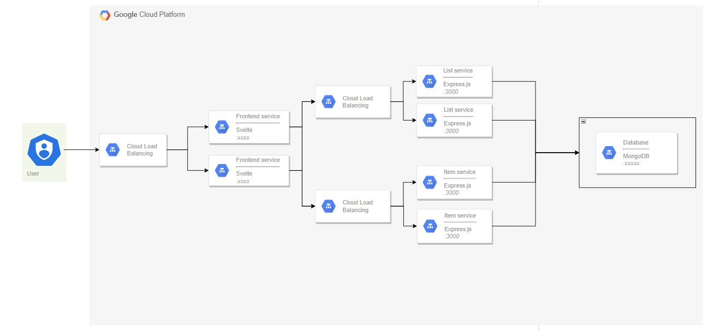

# AGISIT 23: Microservice-Based To-Do List

## Authors - Group 16
| Number | Name               |				
| -------|--------------------|
| 108702 | Isabelle Galleberg |
| 108703 | Ådne Svendsrud     |
| 108444 | Tilde Eriksen Eine | 

## Table of Contents
1. [Application](#application)
3. [Architecture](#architecture)
4. [Services](#services)
5. [Build and Deploy](#build-and-deploy)
6. [Demo](#demo)
7. [License](#license)


## Application
Our application is a simple To-Do list, designed as a microservice-based containerized web application. The core operations are served by microservices as follows:

1. **List service** - Handles adding/removing of items (Express.js)
2. **Item service** - Manages checking/unchecking of items (Express.js)
3. **Frontend service** - Visualization for our To-Do list connected to the Expressed API functions (Svelte).

_Express.js_ is a REST API-based implementation which serves basic To-Do list functions as APIs. We have two Expressed services:
1. **List service** - Adding/removing items to/from list
2. **Item service** - Checking/unchecking an item

The frontend service is a frontend application designed in Svelte.js. It functions as the visualization for our To-Do list, and its functions add/remove items and check/uncheck items are served by the express.js services.

## Architecture 
Our microservice-based architecture ensures scalability and performance. 

Here's a basic outline:

1. **Frontend:** Developed in Svelte.js, providing a sleek, fast, and user-friendly interface.
2. **Backend Services:** Consists of two Expressed services handling operations of our To-Do list.


**Data flow:**
1. Users interact with the Svelte frontend.
2. Requests go through the Express.js services.
3. Any data operation will then be persisted or retrieved from the database service.


The complete architecture of this implementation is as follows:


WORKING: [DRAW.IO](https://drive.google.com/file/d/1YTpFg0gd-9eK2pGvSjLzb5hUPA-y5P1c/view?usp=share_link)
- Usikker på portnr på HAProxy
- Forklar replica set, 2 replicas

We chose to build our cluster using GKE. 

The various microservices are deployed at the following addresses inside the cluster:
|Service       |Cluster Address       |Cluster Port       |API endpoint       |
|  ----------  |  ------------------  |  ---------------  |  ---------------  |
|List          |       |       |       |
|Item          |       |       |       |
|Database      |       |       |       |
|Frontend      |       |       |       |
|Loadbalancer  |       |       |       |
|Dashboard     |       |       |       |


## Services
| Service                         | Language      |Description                                                          |
| ------------------------------- | ------------- | ------------------------------------------------------------------- |
| [frontend](/microservices/frontend/)    | Svelte        | Renders and displays a simple To Do list, with the option to input a new item, remove an item, or check/uncheck an item.  |
| [itemservice](/microservices/itemservice/)  | Express.js | Checks/unchecks items and stores status in users' To Do list in MongoDB. |
| [listservice](/microservices/listservice/) | Express.js | Adds and removes items from To Do list in MongoDB according to users' actions.   |
| [databaseservice](/microservices/databaseservice/) | MongoDB | Persistent storage for users' To Do list items. |


## Build and Deploy
### Prerequisites
#### Tools/Software:
1. **Vagrant:** Download [here](https://developer.hashicorp.com/vagrant/downloads)
2. **Terraform:** Download [here](https://developer.hashicorp.com/terraform/downloads)
3. Shell environment with **gcloud**, **git** and **kubectl**

Additionally, for **Windows**, **macOS (Intel)** and **Linux**:
1. **VirtualBox:** Download [here](https://www.virtualbox.org/wiki/Downloads)
2. **VirtualBox Extension Pack:** Should be installed after installing VirtualBox.

For, **macOs (Apple chips)**:
1. **Docker:** Docker desktop enables to build and run containerized applications. Used since vbox is not supported on Apple Chips.


#### Accounts:
- **Google Cloud Platform (GCP)**: Ensure you have an active GCP account with billing enabled.

Environment Setup:
1. Log in to Google Cloud Platform.
2. Navigate to the **Google Compute Engine** and enable its API.
3. Create a Service Account 
   - Dashboard -> IAM and Administrator -> Service Account -> Mange Keys -> Create A New Key -> Export JSON


### Configuration
1. Clone the project repository to your local machine.
```
git clone https://gitlab.rnl.tecnico.ulisboa.pt/agisit/agisit23-g16.git
```
2. Navigate to the root directory of the project
```
cd agisit23-g16
```
3. Upload the [exported GCP Service Account](#accounts) **'.json'** key to the **'gcpcloud'** files directory.

4. Navigate to the gcpcloud folder and open the file **'terraform-gcp-variables.tf'**.

5. Replace the placeholder values with your specific GCP configurations.

6. The project contains two **Vagrantfiles**: One _Vagrantfile.docker_, and one _Vagrantfile.vbox_. Rename the one you will use to just **"Vagrantfile"**.
    - If you installed **vbox** previously, use **Vagrantfile.vbox** -> **Vagrantfile**
    - If you installed **docker** previously, use **Vagrantfile.docker** -> **Vagrantfile**

Validate your Vagrantfile before proceeding, using the command:
```
vagrant validate
```

7. In the root directory of the project, run the following commands:
```
vagrant up
vagrant ssh mgmt
```
8. **In the mgmt virtual machine**, generate an ssh key by running the following command:

```
ssh-keygen -t rsa -b 2048
```
Hit enter to all prompts, and do not enter a password.

9. To deploy the local RSA key pair for the vagrant user, we run the following command:

```
ssh-addkey.yml --ask-pass
```
The password to use here is **vagrant**.

10. In the mgmt virtual machine **inside the gcpcloud folder**, run:

```
terraform init
terraform plan
terraform apply
```
To check the configurations, you can then run:

```
terraform output
ansible all -m ping
```
11. Finally, after checking that configuration is working as intended, **in the same folder in the VM**, run:
```
ansible-playbook ansible-gcp-servers-setup-all.yml
```

### Finishing
When finished running, **Stop the Virtual Machines** and verify the **global state** of all active Vagrant environments on the system, issuing the following commands:

```
vagrant halt
vagrant global-status
```


## Demo
This is the landing page:


You input your task in the text prompt:


Clicking "add" makes the new item appear in the list:


## License
This project is licensed under the terms of the MIT license.
