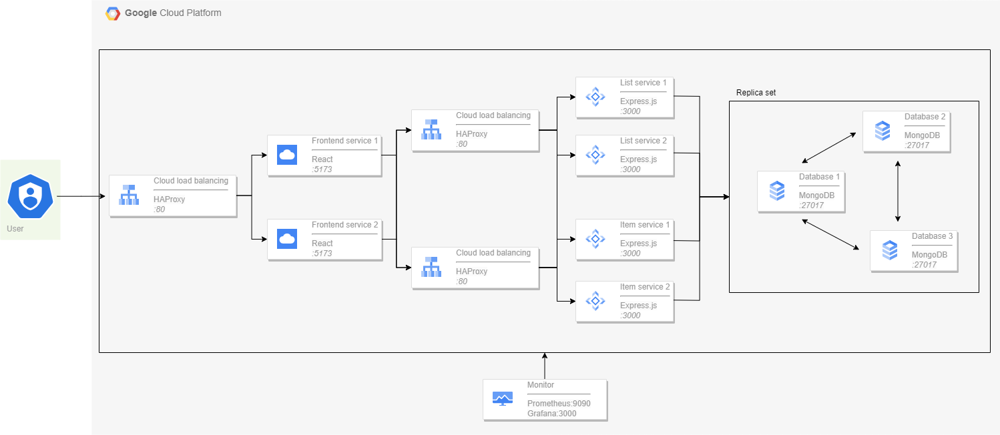
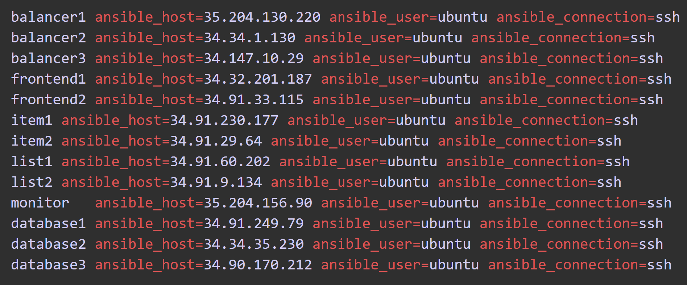

# AGISIT 23: Microservice-Based To-Do List

## Authors - Group 16

| Number | Name               |
| ------ | ------------------ |
| 108702 | Isabelle Galleberg |
| 108703 | Ådne Svendsrud     |
| 108444 | Tilde Eriksen Eine |

## Table of Contents

1. [Application](#application)
2. [Architecture](#architecture)
   1. [Application Flow](#application-flow)
   2. [Components](#components)
3. [Infrastructure](#infrastructure)
   1. [Terraform](#terraform)
   2. [Ansible](#ansible)
4. [Build and Deploy](#build-and-deploy)
   1. [Prerequisites](#prerequisites)
      1. [Tools/Software](#toolssoftware)
      2. [Accounts](#accounts)
   2. [Configuration](#configuration)
   3. [Finishing and cleaning up](#finishing-and-cleaning-up)
5. [Tools & Technologies](#tools--technologies)
6. [License](#license)

## Application

This project demonstrates how to deploy a microservices-based containerized web application on Google Cloud Platform (GCP) using Terraform as the Infrastructure as Code (IaC) tool, with Ansible to manage and provision the infrastructure resources.

Our project goal was to build a resilient and scalable “To-do list” web application, offering monitoring capabilities for system performance and health. 


The core operations are served by microservices as follows:

1. **List service** - Handles adding/removing of items (Express.js)
2. **Item service** - Manages checking/unchecking of items (Express.js)
3. **Frontend service** - Visualization for our To-Do list connected to the Expressed API functions (React).
As well as a monitoring server to allow basic performance monitoring. 


The enhanced solution for the project includes the addition of the following components:
1. **Load balancers** (1 for frontend, 1 for each backend service)
2. **Databases** (Replica set of three database servers)

Our application is a simple “To-do list”, where the user can add, remove, check and uncheck items in the list. The persistent storage of list items and their status is provided by a MongoDB database replica set. The database replica set also contributes to the availability of the service, together with the system load balancers which are implemented for the frontend and both the backend express.js microservices. 

## Architecture

Our architecture can be visualized using the diagram below:

The main parts of our infrastructure can be described as follows:
- Multiple instances of each node service (frontend, item, list) which are load balanced 
- Multiple instances of frontend, list, and item services to ensure scalability.
- A MongoDB database replica set for data storage, and several load balancers ensuring data integrity and availability.
- A monitor using Prometheus and Grafana to oversee system health and performance.

### Application Flow
1. Users access the system through the React-based frontend.
2. User requests are channeled via the HAProxy load balancer to ensure efficient distribution of requests and high availability.
3. Depending on the type of request, it is routed to either the List or Item service.
4. These services interact with the MongoDB database to fetch, modify, or store data.

### Components
| Component                         | Language      | Port |Description                                                          |
| ------------------------------- | ------------- | --|------------------------------------------------------------------- |
| [frontend](/microservices/frontend/)    | React      |5173  | Frontend. Developed using React.js, offering a responsive and user-friendly “To-do” list interface to users.  |
| [itemservice](/microservices/itemservice/)  | Express.js |3000| Backend. Developed in Express.js, responsible for the individual task-related operations of checking and unchecking items. |
| [listservice](/microservices/listservice/) | Express.js |3000| Backend. Developed using Express.js, responsible for managing and handling the overall list operations of adding and removing items from the list.  |
| [database](/microservices/databaseservice/) | MongoDB |27017| Provides persistent storage for the application, and ensures availability by being a replica set of three database servers. Using MongoDB. |
| [load balancer](/gcp/monitoring/templates/) | HAProxy |80| Provided using HAProxy, ensures availability for our three microservices (frontend, list, item). |
| [monitoring](/gcp/monitoring/) | Prometheus, Grafana |9090, 3000| Provided using Prometheus and Grafana |

## Infrastructure
The backbone of our project is provided using Google Cloud Platform to host our servers as VMs. This allows for a simple and robust way to host our infrastructure, and provides easy integration with the other tools in use. 

As mentioned, we chose to implement load balancers and database persistent storage as the advanced components for our project. These are important for ensuring high availability and fault tolerance in our system. 

The infrastructure setup is done through the use of a combination of Terraform and Ansible. These allow for a simple and automated approach to setting up, configuring, and managing our cloud-based resources with an IaC approach. 

### Terraform
Terraform is an Infrastructure as Code (IaC) tool which allows us to manage infrastructure using configuration files. All infrastructure resources, from firewall rules to servers, are defined in Terraform files, which also ensure the resource deployment to GCP. 

Here’s a breakdown of how Terraform is used in our system:
1. **Resource creation:** Our infrastructure objects, like networks, VMs and firewalls, are all defined in Terraform files. 
2. **Outputs:** Once the resources are created, Terraform provides an easy way to extract information on the created resources.

### Ansible
While Terraform creates the instructed resources and objects for our infrastructure, Ansible is used to provision and configure these resources. Ansible ensures that the servers are in the desired state, installs the necessary software, and sets up the required configurations. 

This is all done during configuration, when running the ansible-playbook command described in the [Build and Deploy](#build-and-deploy) section of our README. 


## Build and Deploy

### Prerequisites

#### Tools/Software:

1. **Vagrant:** Download [here](https://developer.hashicorp.com/vagrant/downloads)
2. Shell environment with **git** 

Additionally, for **Windows**, **macOS (Intel)** and **Linux**:

1. **VirtualBox:** Download [here](https://www.virtualbox.org/wiki/Downloads)
2. **VirtualBox Extension Pack:** Should be installed after installing VirtualBox.

For, **macOs (Apple chips)**:

1. **Docker:** Docker desktop enables to build and run containerized applications. Used since vbox is not supported on Apple Chips.

#### Accounts:

- **Google Cloud Platform (GCP)**: Ensure you have an active GCP account with billing enabled, and an active GCP project.

Environment Setup:

1. Log in to Google Cloud Platform.
2. Navigate to the **Google Compute Engine** and enable its API.
3. Create a Service Account
   - Dashboard -> IAM and Administrator -> Service Account -> Manage Keys -> Create A New Key -> Export JSON
   - Save the JSON file to use in the [Configuration](#configuration) steps

### Configuration

1. Open a shell environment, and clone the project repository to your local machine.

```
git clone https://gitlab.rnl.tecnico.ulisboa.pt/agisit/agisit23-g16.git
```

2. Navigate to the root directory of the project.

```
cd agisit23-g16
```

3. Upload the [exported GCP Service Account](#accounts) **'.json'** key to the **'gcp'** files directory.

4. Navigate to the **gcp folder**. You will here need to replace the placeholder values with the specific values for your project in the three following files:

   1. Open the file **'terraform-gcp-variables.tf'**, and update the **GCP_PROJECT_ID** with the correct ID for your GCP project.

   2. Open **'terraform-gcp-provider.tf'** and insert the correct path for your **.json** key for **"credentials"**.

   3. Open **'ansible-load-credentials.sh'**, and update the path for the **.json** file here as well, for the **GCE_PEM_FILE_PATH**. 

5. The project contains two **Vagrantfiles**: One _Vagrantfile.docker_, and one _Vagrantfile.vbox_. Rename the one you will use to just **"Vagrantfile"**.
   - If you installed **vbox** previously, use **Vagrantfile.vbox** -> **Vagrantfile**
   - If you installed **docker** previously, use **Vagrantfile.docker** -> **Vagrantfile**

Validate your Vagrantfile before proceeding, using the command:

```
vagrant validate
```

6. In the root directory of the project, run the following commands:

```
vagrant up
vagrant ssh mgmt
```

7. **In the mgmt virtual machine**, navigate to the **gcp folder**, and generate an ssh key by running the following command:

```
ssh-keygen -t rsa -b 2048
```

Hit enter to all prompts, and do not enter a password.

8.   In the mgmt virtual machine, **still inside the gcp folder**, run:

```
terraform init
terraform apply
```


9.   Finally, **in the same folder in the VM**, run:

```
ansible-playbook ansible-gcp-servers-setup-all.yml
```

10.   At this point, the project is fully set up and provisioned. To view the application frontend in your browser, check the **inventory** file, which should appear in the **gcp** folder after running **terraform apply**.

Your inventory file will look something like this, but note that **the IPs, after "ansible_host=", will be different**.


Here, you should open the IP address provided for **"balancer 1"** to view the frontend in your browser. 

11. To view the Grafana dashboard, enter the IP for **monitor** from the **inventory** file, with the port number **:3000**. 

The site has no password, so the credentials for both fields is just "admin". This should lead you to the Grafana landing page. Open the hamburger meny in the top left corner, click **"Dashboards"** and navigate to the dashboard named **"todo_service_dashboard"**.

### Finishing and Cleaning Up

When finished running the project, **Stop Terraform**, and **Stop the Virtual Machines**. 

Stop and verify the state for Terraform using the following commands: 

```
terraform destroy
terraform refresh
```

Stop and verify the **global state** of all active Vagrant environments on the system, with the following commands:

```
vagrant halt
vagrant global-status
```


## Tools & Technologies:

- **Vagrant:** Used to automate the setup of our development environments, ensuring a uniform development platform across the team.
- **Ansible:** IT automation tool that can be used to configure systems and deploy software. Standardizes our application's environment, guaranteeing consistent behaviour across all stages, from dev to prod.
- **Terraform:** IaC tool which makes it easy to manage and deploy our infrastructure systematically and repeatably.
- **Express.js:** A minimalist web framework for Node.js, which lets us build flexible backend services efficiently.
- **MongoDB:** A NoSQL database that allows for a simple way to set up persistent storage in our application.
- **React:** A javaScript component framework. Chosen due to team experience.

